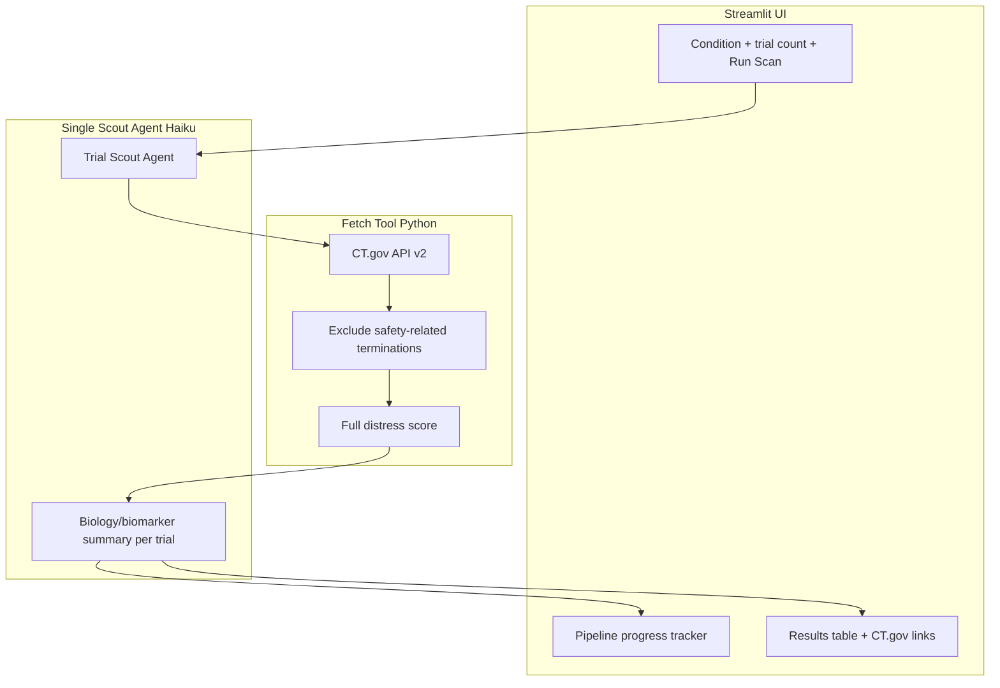
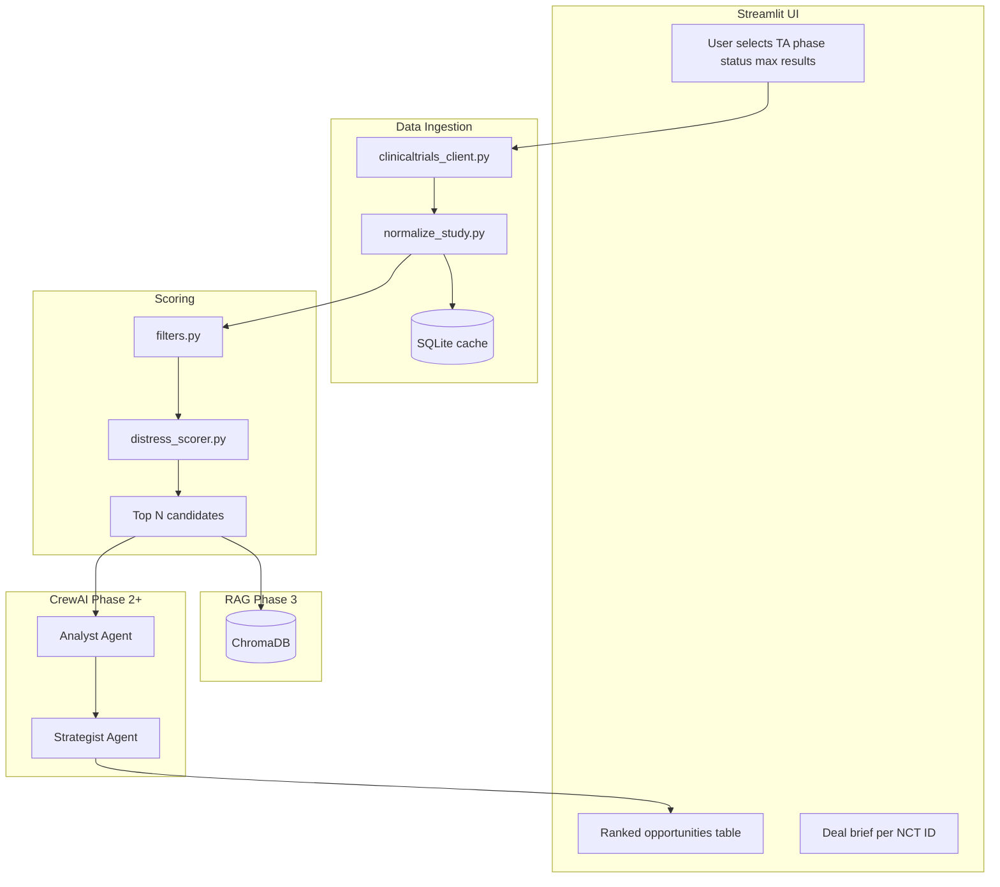

# Distressed Trial Scout — Build Plan

## Goal

**Distressed Trial Scout** is a **local deal-sourcing engine** that screens therapeutic areas on [ClinicalTrials.gov](https://clinicaltrials.gov) for clinical programs that appear **distressed or stalled** yet **biologically plausible**, then produces **VC spin-out / in-licensing briefs** you can review in a simple web UI.

**Build approach:** Ship a **very simple MVP first** (single agent, no RAG), then layer on scoring, dual agents, and RAG in later phases.

**Project location:** `C:\Users\palai\Projects\distressed-trial-scout\`

---

## Phase overview

| Phase | Scope | LLM | RAG |
|-------|-------|-----|-----|
| **0 — Simple MVP** | Single agent, halted + stale-active trials, safety-only filter, full distress score | Haiku | None |
| **1 — Enhanced screening** | SQLite cache, extra UI filters, score tooltips, CSV export | Haiku | None |
| **2 — Deal intelligence** | Analyst + Strategist agents, structured deal briefs | Sonnet | None |
| **3 — Full product** | ChromaDB RAG, playbook upload, history, export, tests | Sonnet | ChromaDB |

---

# Phase 0 — Simple MVP (build this first)

## MVP goal

A working app you can run locally today: enter a therapeutic area, fetch distressed and stalled trials, automatically exclude **safety-related** stops (while keeping efficacy/futility cases), score them with the full distress heuristics, and get a clean results table with biology summaries—powered by **one agent** and **Claude Haiku**.

## MVP stack

| Layer | Choice |
|-------|--------|
| Orchestration | **CrewAI** — single agent, one task |
| LLM | **Claude Haiku** (`anthropic/claude-haiku-4-5`) — fast and cheap |
| Data | **ClinicalTrials.gov API v2** — no CSV, no cache required for MVP |
| RAG | **None** — trial text passed directly to the agent |
| UI | **Streamlit** — minimal inputs, clean results table |

## MVP data flow



**Run sequence per scan:**
1. User enters **therapeutic area / condition** and **number of trials to fetch**, then clicks **Run Scan**.
2. UI shows pipeline progress: `Fetching trials → Filtering → Scoring → Analyzing`.
3. **Scout agent** calls the `fetch_halted_trials` tool with condition + count.
4. Tool queries CT.gov with `filter.overallStatus=TERMINATED,SUSPENDED,WITHDRAWN,ACTIVE_NOT_RECRUITING,NOT_YET_RECRUITING`.
5. Tool **excludes** trials whose `whyStopped` indicates a **safety-related** stop only—trials stopped for efficacy/futility are **kept** (see filter logic below).
6. Tool applies the **full distress score** (halted + stale-active signals) to remaining trials and returns normalized records.
7. Agent produces a **biology/biomarker summary** (2–3 sentences) for each trial from registry text.
8. UI renders the **results table** with clickable ClinicalTrials.gov links.

## MVP fetch tool

**API query:**

```
GET https://clinicaltrials.gov/api/v2/studies
  ?query.cond={condition}
  &filter.overallStatus=TERMINATED,SUSPENDED,WITHDRAWN,ACTIVE_NOT_RECRUITING,NOT_YET_RECRUITING
  &sort=LastUpdatePostDate:desc
  &pageSize={min(requested_count, 100)}
  &fields=NCTId,BriefTitle,OverallStatus,Phase,LeadSponsorName,WhyStopped,...
```

Paginate with `nextPageToken` until the requested count is reached or pages are exhausted. Throttle ~1 req/sec.

## Safety exclusion filter

Applied **deterministically in Python** inside the fetch tool (not left to LLM judgment alone). Only **safety-related** stops are dropped. Trials stopped for **efficacy or futility** are intentionally **kept**—these may still represent biologically sound programs that failed on endpoint, which can be interesting for deal sourcing.

**Exclude if `whyStopped` contains (case-insensitive):**

| Category | Keywords / phrases |
|----------|-------------------|
| Safety | `safety`, `adverse`, `toxicity`, `tolerability`, `dose-limiting`, `SAE`, `side effect`, `harm` |

**Keep** trials stopped for efficacy/futility (`efficacy`, `futility`, `lack of efficacy`, `did not meet`, etc.), plus business decision, funding, enrollment difficulty, strategic, sponsor decision, COVID, administrative, logistics, and all other non-safety reasons.

If `whyStopped` is **empty or missing**, **keep** the trial (assume reason unknown—not automatically excluded).

```python
# Conceptual filter in src/pipeline/filters.py
SAFETY_EXCLUDE_PATTERNS = [
    r"safety", r"adverse", r"toxicity", r"tolerability",
    r"dose-limiting", r"\bsae\b", r"side effect", r"harm",
]

def is_safety_stop(why_stopped: str | None) -> bool:
    if not why_stopped:
        return False
    text = why_stopped.lower()
    return any(re.search(p, text) for p in SAFETY_EXCLUDE_PATTERNS)
```

## MVP distress score (full heuristics)

Computed before the LLM call—a 0–100 score using halted **and** stale-active signals:

| Signal | Source field (API v2) | Weight / logic |
|--------|----------------------|----------------|
| Halted status | `overallStatus` ∈ {TERMINATED, SUSPENDED, WITHDRAWN} | +40 |
| Stale active trial | ACTIVE_NOT_RECRUITING or NOT_YET_RECRUITING; `lastUpdatePostDate` > 18 months ago | +25 |
| Late-stage stall | Phase PHASE2 or PHASE3 + non-recruiting status | +15 |
| Non-safety early termination | `whyStopped` populated (and not a safety stop) | +10 |
| Low enrollment vs. design | `enrollmentInfo.count` vs. phase norms (heuristic) | +5–10 |
| Has posted results | results section present | +5 |

Sort results by distress score descending. Expose score breakdown in UI tooltip (Phase 1+).

## Single Scout agent

**Role:** Trial Scout  
**Goal:** Find strategically interesting halted trials in a therapeutic area and summarize their biology  
**LLM:** Claude Haiku  
**Tools:** `fetch_halted_trials(condition, max_count)` — returns pre-filtered, pre-scored trial records  

**Task:** Given `{condition}` and `{max_count}`, use the fetch tool, then for each returned trial write a concise **biology/biomarker summary** covering: target/MOA, intervention type, relevant biomarkers mentioned in the registry text, and any posted efficacy signals. Do not include trials filtered out for safety-related stops.

**Output schema (Pydantic):**

```python
class TrialResult(BaseModel):
    nct_id: str
    title: str
    sponsor: str
    phase: str
    status: str
    distress_score: float
    biology_summary: str  # 2-3 sentences
    ctgov_url: str        # https://clinicaltrials.gov/study/{nct_id}
```

```python
# Conceptual agent setup in src/agents/scout.py
from crewai import Agent, Crew, LLM, Task

haiku = LLM(
    model="anthropic/claude-haiku-4-5",
    api_key=os.getenv("ANTHROPIC_API_KEY"),
    max_tokens=4096,
    temperature=0.2,
)

scout = Agent(
    role="Trial Scout",
    goal="Identify halted trials with interesting biology in a therapeutic area",
    backstory="Expert in clinical trial registry data and drug mechanism analysis.",
    llm=haiku,
    tools=[fetch_halted_trials],
)
```

## MVP Streamlit UI

**App title:** Distressed Trial Scout

**Inputs only (sidebar or main):**
- Therapeutic area / condition (text input)
- Number of trials to fetch (number input, default 10, max 50)
- **Run Scan** button

No phase filter, no status picker, no playbook upload in MVP.

**Outputs:**
1. **Pipeline progress tracker** — step indicators or progress bar:
   - Fetching trials from ClinicalTrials.gov
   - Filtering safety-related terminations
   - Scoring distress signals
   - Generating biology summaries
2. **Results table** — columns:
   - NCT ID (linked to CT.gov)
   - Title
   - Sponsor
   - Phase
   - Status
   - Distress score
   - Biology / biomarker summary
3. **ClinicalTrials.gov links** — each NCT ID links to `https://clinicaltrials.gov/study/{NCT_ID}`

Use `st.session_state` so re-renders don't re-trigger scans. Use `st.dataframe` with column config for link rendering, or build links in the NCT ID column.

## MVP project structure

```
distressed-trial-scout/
├── BUILD_PLAN.md
├── README.md
├── .env.example                 # ANTHROPIC_API_KEY
├── requirements.txt             # no chromadb or sentence-transformers
├── app/
│   ├── streamlit_app.py         # streamlit run app/streamlit_app.py
│   └── config.py
└── src/
    ├── api/
    │   └── clinicaltrials_client.py
    ├── models/
    │   └── trial_record.py
    ├── pipeline/
    │   ├── normalize_study.py
    │   ├── filters.py           # safety-only exclusion
    │   └── distress_scorer.py   # full distress heuristics
    ├── agents/
    │   ├── scout.py             # single agent + crew
    │   ├── tools.py             # fetch_halted_trials CrewAI tool
    │   └── schemas.py           # TrialResult
    └── __init__.py
```

## MVP dependencies

```
streamlit>=1.32
crewai[anthropic]>=0.80
anthropic>=0.40
httpx>=0.27
pydantic>=2.6
python-dotenv>=1.0
pandas>=2.2
tenacity>=8.2
```

## MVP configuration

[`app/config.py`](app/config.py):

- `LLM_MODEL = "anthropic/claude-haiku-4-5"`
- `DEFAULT_TRIAL_COUNT = 10`
- `MAX_TRIAL_COUNT = 50`
- `DISTRESSED_STATUSES = ["TERMINATED", "SUSPENDED", "WITHDRAWN", "ACTIVE_NOT_RECRUITING", "NOT_YET_RECRUITING"]`
- `STALE_MONTHS = 18`
- `SAFETY_EXCLUDE_PATTERNS` — list of regex strings for safety-only filter
- `DISTRESS_WEIGHTS` dict — weights for full scoring heuristics

## MVP success criteria

- [ ] User enters a condition and trial count, clicks Run Scan, and gets results within a few minutes
- [ ] Halted and stale-active trials appear (TERMINATED, SUSPENDED, WITHDRAWN, ACTIVE_NOT_RECRUITING, NOT_YET_RECRUITING)
- [ ] Trials stopped for safety reasons are excluded; efficacy/futility stops are kept
- [ ] Distress score reflects full heuristics including stale-active signals
- [ ] Results table shows all required columns plus working CT.gov links
- [ ] Pipeline progress is visible during the scan
- [ ] App runs locally with only `ANTHROPIC_API_KEY` required

## MVP cost and runtime

| Step | Cost |
|------|------|
| Fetch 10–50 trials | Free (CT.gov) |
| Haiku analysis of 10 trials | ~$0.05–0.20 |
| Haiku analysis of 50 trials | ~$0.25–1.00 |

**Runtime:** Fetch ~30s–2min; LLM analysis ~1–5min for 10 trials.

---

# Phase 1 — Enhanced screening (post-MVP)

Add capabilities without RAG or dual agents:

- SQLite cache to avoid re-fetching
- Phase and status filters in UI
- Distress score breakdown tooltips in results table
- Optional CSV export

---

# Phase 2 — Deal intelligence

- **Two-agent CrewAI workflow:** Analyst → Strategist
- **LLM upgrade:** Claude Sonnet for deal brief quality
- Structured `DealBrief` output (thesis, deal type, risks, diligence checklist)
- Still no RAG—registry text only

---

# Phase 3 — Full product

- ChromaDB + local sentence-transformers embeddings
- BD playbook upload for Strategist context
- Scan history page, batch mode, tests
- Optional PubMed enrichment and Voyage AI embeddings

---

## Full-product architecture (Phase 3 target)

The sections below describe the **end-state** after all phases. Phase 0 MVP implements only the subset described above.

### Recommended stack (full product)

| Layer | Choice | Verdict |
|-------|--------|---------|
| Orchestration | **CrewAI** | Analyst + Strategist in Phase 2+ |
| LLM | **Haiku** (MVP) → **Sonnet** (Phase 2+) | Haiku for screening; Sonnet for deal briefs |
| Embeddings | **Local sentence-transformers** | Phase 3 only |
| Data | **CT.gov API v2** | Public, no auth |
| Vector DB | **ChromaDB** | Phase 3 only |
| UI | **Streamlit** | Progressive feature additions |

**Architecture principle (Phase 2+):** Use **deterministic rules** to narrow candidates, then use **LLM agents** only on the shortlist.

### Full-product distress score (Phase 1+)

| Signal | Source field (API v2) | Weight / logic |
|--------|----------------------|----------------|
| Halted status | TERMINATED, SUSPENDED, WITHDRAWN | +30 to +40 |
| Stale active trial | ACTIVE_NOT_RECRUITING / NOT_YET_RECRUITING; last update > 18 months | +25 |
| Late-stage stall | Phase 2/3 + non-recruiting | +15 |
| Early termination (non-safety) | `whyStopped` populated (and not a safety stop) | +10 |
| Low enrollment vs. design | enrollment heuristics | +5–10 |

### Full-product data flow (Phase 3)



### Full-product project structure (Phase 3 target)

```
distressed-trial-scout/
├── README.md
├── .env.example
├── requirements.txt
├── app/
│   ├── streamlit_app.py
│   ├── config.py
│   └── pages/
│       ├── scan.py
│       └── history.py
├── src/
│   ├── api/clinicaltrials_client.py
│   ├── models/trial_record.py
│   ├── pipeline/
│   │   ├── normalize_study.py
│   │   ├── filters.py
│   │   ├── distress_scorer.py
│   │   └── ingest.py
│   ├── rag/                     # Phase 3
│   │   ├── chroma_store.py
│   │   └── chunk_study.py
│   ├── agents/
│   │   ├── scout.py             # Phase 0 MVP
│   │   ├── crew.py              # Phase 2+
│   │   ├── analyst.py
│   │   ├── strategist.py
│   │   ├── tools.py
│   │   └── schemas.py
│   └── storage/sqlite_cache.py  # Phase 1+
├── data/
│   ├── chroma/
│   └── playbooks/
└── tests/
```

---

## Environment variables

```
ANTHROPIC_API_KEY=sk-ant-...
```

Phase 3 optional: `VOYAGE_API_KEY=pa-...`

---

## Setup checklist (MVP)

1. Install Python 3.11+
2. `cd Projects/distressed-trial-scout && python -m venv .venv`
3. Activate venv, `pip install -r requirements.txt`
4. Copy `.env.example` → `.env`, add `ANTHROPIC_API_KEY` from [console.anthropic.com](https://console.anthropic.com)
5. `streamlit run app/streamlit_app.py`
6. Run first scan: condition = `"idiopathic pulmonary fibrosis"`, trials = 10

---

## Risks and mitigations

| Risk | Mitigation |
|------|------------|
| Safety filter misses edge cases | Keyword list in `config.py`; log excluded trials count in UI; refine patterns over time |
| Efficacy/futility trials kept by design | Agent should note endpoint failure in biology summary when `whyStopped` indicates futility |
| Empty `whyStopped` keeps unknown trials | Acceptable for MVP—agent can note uncertainty in biology summary |
| LLM hallucinates biomarkers | Instruct agent to cite only registry text; prefix summary with "Per registry:" |
| CT.gov API rate limits | Throttle requests; add SQLite cache in Phase 1 |
| CrewAI overhead for simple MVP | Single agent + one task keeps complexity minimal |

---

## Optional future extensions

- LangGraph for human-in-the-loop approval between agents
- Open Targets / ChEMBL for target validation
- SEC / press release scraper for deprioritization signals
- Email alerts for new halted trials in watched TAs
- Multi-user deploy on Streamlit Cloud
